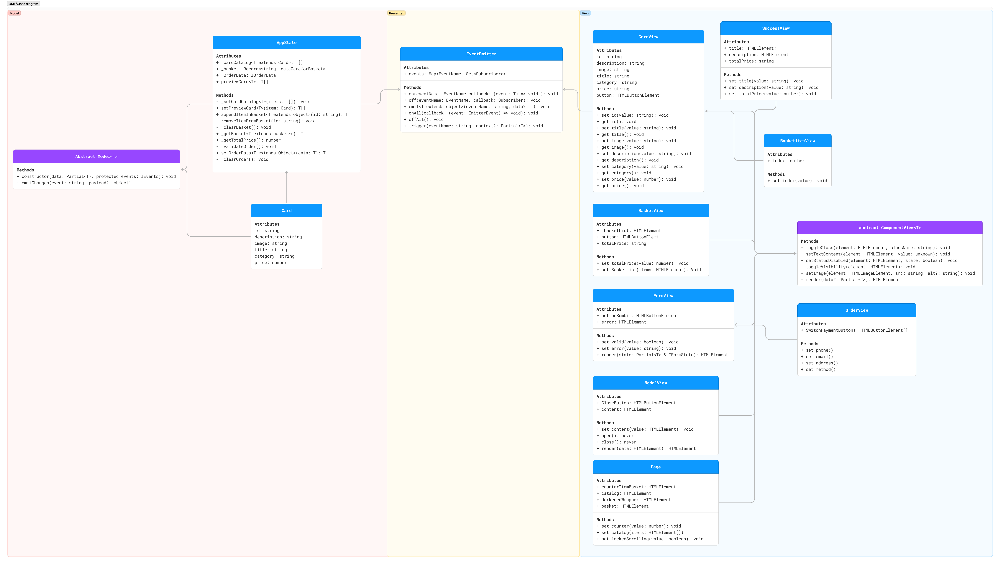

# Проектная работа "Веб-ларек"

Стек: HTML, SCSS, TS, Webpack

Структура проекта:
- src/ — исходные файлы проекта
- src/components/ — папка с JS компонентами
- src/components/base/ — папка с базовым кодом

Важные файлы/папки:
- src/pages/index.html — HTML-файл главной страницы
- src/types/ — папка с типами
- src/index.ts — точка входа приложения
- src/styles/styles.scss — корневой файл стилей
- src/utils/constants.ts — файл с константами
- src/utils/utils.ts — файл с утилитами

## Установка и запуск
Для установки и запуска проекта необходимо выполнить команды

```
npm install
npm run start
```

или

```
yarn
yarn start
```
## Сборка

```
npm run build
```

или

```
yarn build
```

## Архитектура
### UML-схема классов и их связей


Выбран принцип MVP. 
Взаимодействие происходит через брокер событий.

### События
---
**Клик по карточке товара** - обработчик передаёт данные объекта Card в CardView, где далее формируется контент и открывается модальное окно с этим контентом.

**Клик по кнопке закрытия попапа** - обработчик вызовет метод close() объекта ModalView

**Клик по кнопке "В корзину" внутри попапа** - обработчик вызовет объект AppState, где методом appendItemInBasket товар добавится свойство basket

\\ TODO Сделать нумерованным списком и добавлять вложенные списки