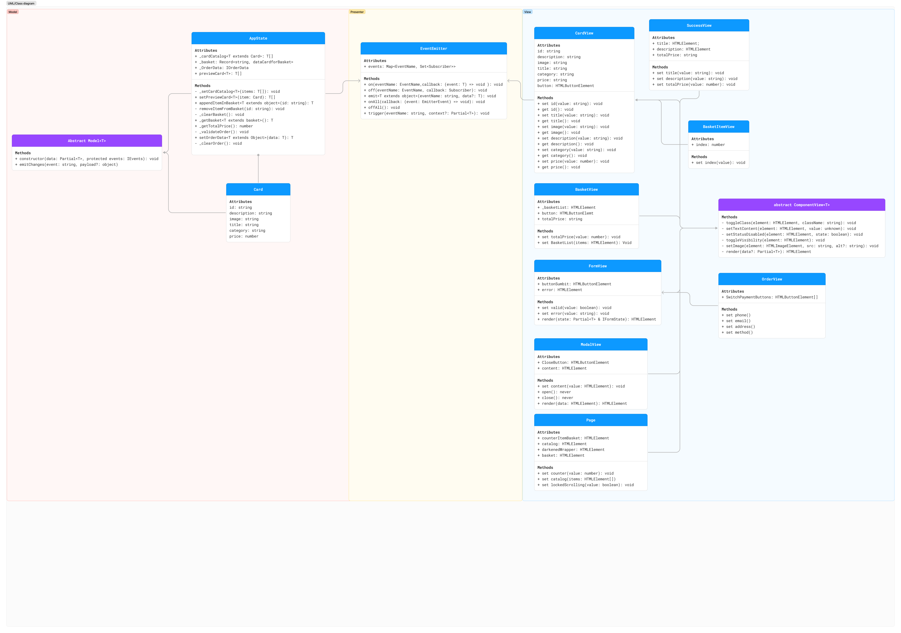

# Проектная работа "Веб-ларек"

Стек: HTML, SCSS, TS, Webpack

Структура проекта:
- src/ — исходные файлы проекта
- src/components/ — папка с JS компонентами
- src/components/base/ — папка с базовым кодом

Важные файлы/папки:
- src/pages/index.html — HTML-файл главной страницы
- src/types/ — папка с типами
- src/index.ts — точка входа приложения
- src/styles/styles.scss — корневой файл стилей
- src/utils/constants.ts — файл с константами
- src/utils/utils.ts — файл с утилитами

## Установка и запуск
Для установки и запуска проекта необходимо выполнить команды

```
npm install
npm run start
```

или

```
yarn
yarn start
```
## Сборка

```
npm run build
```

или

```
yarn build
```

## Архитектура
### UML-схема классов и их связей

Выбран принцип MVP с брокером событий.
Слой модели подготавливает данные для отображения, а класс отображения показывает изменённые данные, которые этому классу предоставляются с помощью метода emit класса EventEmitter.
Взаимодействие классов отображение происходит только через методы класса Eventemitter.

### События
---

1. `card:select`  - выбор карточки <br>
    1. Обработчик этого события, получая данные, вызовет `AppState.setPreviewCard()`
    2. `setPreviewCard()` вызывает `EventEmitter.emit()`
    3. `emit()` вызывает `preview:change` и передаёт ему данные конкретного товара

2. `preview:change` - изменение превью карточки <br>
    * Получая данные, передаёт их в класс Modal(через посредника EventEmitter), который отрисовывает своими методами окно товара.

3.  `basket:addItem` - добавления товара в корзину <br>
    1. Обработчик этого события, получая данные, вызовет `AppState.appendItemInBasket(item)` для записи в `AppState.basket`.
    2. Вернёт данные для передачи в класс `PageView`(через посредника) и последующей отрисовки счётчика корзины.
    
5. `basket:open` - открытие корзины <br>
    * Передаёт данные  из `AppState.basket` и `appState.getTotalPrice()`(через посредника) в класс `BasketView` для последующей отрисовки окна с корзиной

6. `basket:removeItem` - удаления товара из корзины <br>
    1. Передаст данные в метод `AppState.removeItemFromBasket(id)` для удаления товара из корзины.
    2. Вернёт данные для передачи в класс `PageView`(через посредника) и последующей отрисовки счётчика корзины.
7. `order:open` - открытия формы заказа <br>
    * Вызовет `AppState.validateOrder()`  и будет передавать ошибки валидации(через посредника) в класс `FormView` для последующего отображения
8. `order:setData` - ввод данных <br>
    *Получая данные, записывает их в `AppState.orderData`
9. `order:postData` - отправка данных заказа <br>
    *Отправляет данные методом `post` класса `Api`, передавая ему `AppState.orderData`
10. `success:view` - успешная оплата <br>
    * Вызывает такие методы  класса `AppState`, как:<br>
        * `clearOrder()`
        * `clearBasket()`  
        
<br>
Остальные события:

* `catalog:init` - инициализация каталога товаров <br>
    *   Получает карточки товара из `appState.cardCatalog` и передаёт их через посредника в класс `PageView` для дальнейшей отрисовки

* `modal:state` - состояние модального окна(открыт / закрыт)
    * Обработчики через посредника передают состояние в `PageView.darkenedWrapper` для отображения/снятия затемняющей фон обёртки
    
### Базовый код
---
1. Класс ComponentView Находится в основе большинства компонентов проекта, реализует работу с DOM-элементами.
В конструкторе принимает контейнер- DOM-элемент для взаимодействия.

2. Класс EventEmmiter Реализует паттерн «наблюдатель» и позволяет подписываться на события и уведомлять подписчиков о наступлении события. Конструктор принимает экземпляр объекта Map и записывает его в свойство _events.

3. Класс API Отвечает за получение и отправку данных на сервер.
Принимает в конструкторе baseURL- основной корневой адрес и options- опции для запроса, записывает в свойства полученные данные и заголовки.

4. Класс Model - абстрактный класс, чтобы можно было отличить модель от простых объектов с данными. Наследуется классом AppState.
Конструктор принимает data- объект для проверки и events- события, возвращает измененный объект.

### Компоненты 
---
#### Model

1. Класс AppState<br>
Управляет содержимым всего приложения, позволяет покупателю полностью пользоваться сайтом. Конструктор по умолчанию

2. Класс Card <br> 
Получает данные экземпляра карточки товара для последующего отображения или манипуляциями с данными. Конструктор по умолчанию

#### View

1. Класс CardView <br>
Отображает элемент товара.Конструктор принимает blockName- название блока с карточкой, container- DOM-элемент, шаблон карточки и actions- функции для взаимодействия. Записывает в свойства конкретные DOM-элементы

2. Класс BasketItemView <br>
Устанавливает индекс товара в корзине.Наследует конструктор + устанавливает в свойство index DOM-элемент для индекса.

3. Класс SuccessView <br>
при удачной оплате товара, отображает окно успешной оплаты. Конструктор принимает контейнер-модальное окно и действия для закрытия окна, также устанавливает окну название.

4.  Класс BasketView <br>
Устанавливает товары, находящиеся в корзине и итоговую стоимость. Конструктор принимает контейнер-корзину и записывает в свойства конкретные DOM-элементы

5. Класс FormView <br>
Реализует форму оплаты. Конструктор принимает контейнер (HTML элемент) для взаимодействия с компонентами. Записывает в свойства конкретные DOM-элементы

6. Класс ModalView <br>
Реализует модальное окно приложения. Конструктор принимает контейнер-модальное окно и записывает в свойства конкретные DOM-элементы

7. Класс PageView <br>
Собирает страницу воедино. Конструктор принимает контейнер-страницу(page) и записывает в свойства конкретные DOM-элементы

8. Класс OrderView <br>
Устанавливает данные пользователя в форму оплаты. Конструктор принимает контейнер с формой и устанавливает в свойство _altButtons DOM-элемент


### Используемые интерфейсы и типы данных
---
#### Базовые:
**api.ts**
```ts
//тип, описывающий методы для отправки данных
type ApiPostMethods = 'POST' | 'PUT' | 'DELETE';

//тип, описывающий присылаемые данные с сервера методом GET
type ApiListResponse<Type> = {
    total: number,
    items: Type[]
};
```
**component.ts**

```ts
//Интерфейс, описывающий абстрактный компонент
interface IComponentView<T> {
    toggleClass(element: HTMLElement, className: string): void
    setTextContent(element: HTMLElement, value: unknown): void
    setStatusDisabled(element: HTMLElement, state: boolean): void
    toggleVisibility(element: HTMLElement): void
    setImage(element: HTMLImageElement, src: string, alt?: string): void
    render(data?: Partial<T>): HTMLElement
}
```

**events.ts**

```ts
//тип, описывающий название события
type EventName = string | RegExp;
//тип, описывающий подписчика на событие
type Subscriber = Function;

//Интерфейс, описывающий методы брокера событий
interface IEvents {
    on<T extends object>(event: EventName, callback: (data: T) => void): void;
    emit<T extends object>(event: string, data?: T): void;
    trigger<T extends object>(event: string, context?: Partial<T>): (data: T) => void;
}
```

**model.ts**

```ts
//Интерфейс, описывающий абстрактный класс Model
interface IModel<T> {
    emitChanges(event: string, payload?: object): void
}
```

#### Модели данных:

```ts
//Интерфейс, описывающий объект карточки
interface ICard {
    id: string;
    description: string;
    image: string;
    title: string;
    category: string;
    price: number;
}
//дополнительный интерфейс для формата записи в корзину
interface dataCardforBasket {
    title: string;
    price: number;
}
//Интерфейс, описывающий состояние приложения
interface IAppState<T extends ICard, U extends Object> {
    _cardCatalog: T[];
    _basket: Record<string, dataCardforBasket>;
    _OrderData: U;
    previewCard: T[];
    _setCardCatalog<T>(items: T[]): void;
    setPreviewCard<T>(item: ICard): T[] ;
    appendItemInBasket<T extends object>(id: string): T;
    removeItemFromBasket(id: string): void;
    _clearBasket(): void;
    _getBasket<K>(): K;
    _getTotalPrice(): number;
    _validateOrder(): void;
    setOrderData(data: U): U;
    _clearOrder(): void;
}
```

#### Отображения:

```ts
//Интерфейс, описывающий корзину
interface IBasket {
    _basketList: HTMLElement;
    button: HTMLButtonElement;
    totalPrice: string;
}
//Интерфейс, описывающий счётчик элементов корзины
interface IBasketItemView {
    index: number;
}
//Интерфейс, описывающий карточку
interface ICardView {
    id: string;
    description: string;
    image: string;
    title: string;
    category: string;
    price: string;
    button: HTMLButtonElement;
}
//Интерфейс, описывающий состояния валидации формы
interface IFormState {
    valid: boolean;
    errors: string[];
}
//Интерфейс, описывающий форму
interface IFormView<T> {
    buttonSumbit: HTMLButtonElement;
    error: HTMLElement;
    render(state: Partial<T> & IFormState): HTMLElement;
}
//Интерфейс, описывающий заказ
interface IOrderView {
    SwitchPaymentButtons: HTMLButtonElement[];
}
//Интерфейс, описывающий страницу
interface IPageView {
    counterItemBasket: HTMLElement;
    catalog: HTMLElement;
    darkenedWrapper: HTMLElement;
    basket: HTMLElement;  
}
//Интерфейс, описывающий успешное выполнение
interface ISuccessView {
    title: HTMLElement;
    description: HTMLElement;
    totalPrice: string;
}
```