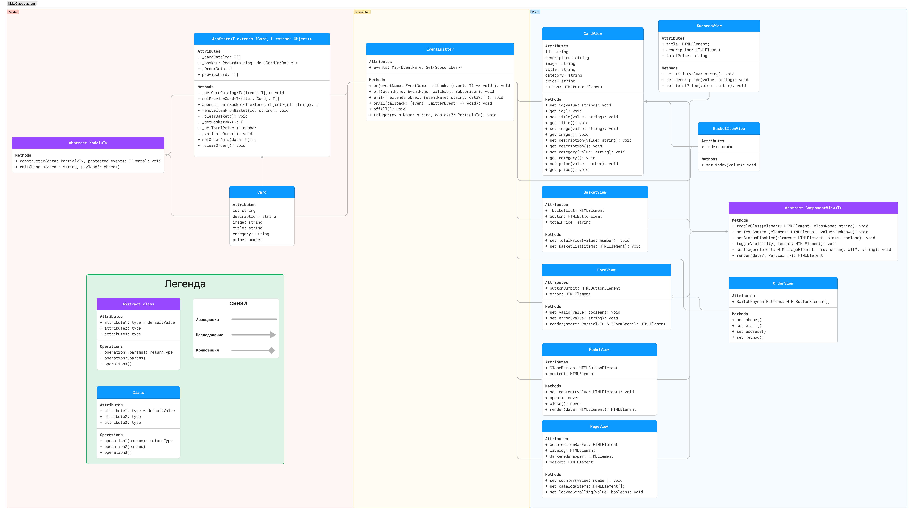

# Проектная работа "Веб-ларек"

Стек: HTML, SCSS, TS, Webpack

Структура проекта:
- src/ — исходные файлы проекта
- src/components/ — папка с JS компонентами
- src/components/base/ — папка с базовым кодом

Важные файлы/папки:
- src/pages/index.html — HTML-файл главной страницы
- src/types/index.ts — файл с типами
- src/index.ts — точка входа приложения
- src/styles/styles.scss — корневой файл стилей
- src/utils/constants.ts — файл с константами
- src/utils/utils.ts — файл с утилитами

## Установка и запуск
Для установки и запуска проекта необходимо выполнить команды

```
npm install
npm run start
```

или

```
yarn
yarn start
```
## Сборка

```
npm run build
```

или

```
yarn build
```

## Архитектура
### UML-схема классов и их связей

Выбран принцип MVP с брокером событий.
Слой модели подготавливает данные для отображения, а класс отображения показывает изменённые данные, которые этому классу предоставляются с помощью метода emit класса EventEmitter.
Взаимодействие классов отображение происходит только через методы класса Eventemitter.

### События
---
1. `catalog:init`: инициализация каталора товаров

2. `card:select`  - выбор карточки <br>
  
3. `preview:change` - изменение превью карточки <br>
   
4. `basket:open` - открытие корзины <br>

5. `basket:change` изменение корзины<br>

6. `order:open` - открытия формы заказа <br>

7. `formErrors:change` изменение ошибок форм<br>

8. `order:submit` -  подтверждение заказа, переход к контактам<br>

9. `order:ready` - готовность заказа, валидация контактов <br>

10. `contacts:submit` - успешная оплата <br>

11. `modal:open` и `modal:close` - открытие и закрытие модального окна


### Базовый код
---
1. Класс `Component` Находится в основе большинства компонентов проекта, реализует работу с DOM-элементами.
В конструкторе принимает контейнер- DOM-элемент для взаимодействия.

2. Класс `EventEmmiter` Реализует паттерн «наблюдатель» и позволяет подписываться на события и уведомлять подписчиков о наступлении события. Конструктор принимает экземпляр объекта Map и записывает его в свойство _events.

3. Класс `API` Отвечает за получение и отправку данных на сервер.
Принимает в конструкторе baseURL- основной корневой адрес и options- опции для запроса, записывает в свойства полученные данные и заголовки.

4. Класс `Model` - абстрактный класс, чтобы можно было отличить модель от простых объектов с данными.
Конструктор принимает data- объект для проверки и events- события, возвращает измененный объект.

### Компоненты 
---
####Общие

1. Класс `Basket` <br>
Отображает содержимое корзины
Конструктор:
```ts
 constructor(events: EventEmitter) {
        super(events, cloneTemplate(Basket.template));

        this._list = ensureElement<HTMLElement>('.basket__list', this.container);
        this._total = ensureElement<HTMLElement>('.basket__price', this.container);
        this._button = ensureElement<HTMLElement>('.basket__button', this.container);

        this._button.addEventListener('click', () => {
            events.emit('order:open');
        });

        this.items = [];
    }
```
2. Класс `Form` <br>
Управляет отображением валидации и ошибок.
Конструктор:
```ts
constructor(protected container: HTMLFormElement, protected events: IEvents)
```
3. Класс `Modal` <br>
Управляет отображением модального окна и его контента
Конструктор:
```ts
constructor(container: HTMLElement, protected events: IEvents)
```
4. Класс `Success` <br>
Отображает контент окна с успешной оплатой
Конструктор :
```ts
constructor(container: HTMLElement, actions: ISuccessActions)
```


#### Model

1. Класс `AppState`<br>
Управляет содержимым всего приложения, позволяет покупателю полностью пользоваться сайтом.
```ts
constructor(protected events: IEvents) 
```
2. Класс `WebLarekAPI` <br>
Отправляет запросы к серверу.
```ts
constructor(cdn: string, baseUrl: string, options?: RequestInit)
```


#### View

1. Класс `CardView` <br>
Отображает элемент товара.
```ts 
constructor(container: HTMLElement, actions?: ICardActions)
```

7. Класс `PageView` <br>
Собирает страницу воедино.
```ts
 constructor(container: HTMLElement, protected events: IEvents)
```

8. Класс `OrderView` <br>
Устанавливает данные пользователя в форму оплаты.
```ts
constructor(events: EventEmitter, container: HTMLFormElement)
```

9. Класс `ContactsView` <br>
Устанавливает контактные данные пользователя.
Конструктор по умолчанию.


### Используемые интерфейсы и типы данных
---
```ts

export type IOrderForm = Omit<IOrder, 'total'|'items' >;

export type IFormErrors = Partial<Record<keyof IOrderForm, string>>;

export type IPaymentMethod = 'cash' | 'card';

export type CardModifier = 'compact' | 'full';

export interface ICard {
    id: string;
    name: string;
    price: number | null;
    description: string;
    image: string;
    category: string;
}

export interface IBasket{
    items: string[];
    total: number;
}

export interface IOrder {
    payment: IPaymentMethod;
    email: string;
    phone: string;
    address: string;
    total: number;
    items: string[];
}

export interface IOrderResult {
    id: string;
    total: number;
}

export interface ICardActions {
    onClick(event: MouseEvent): void;
}

export interface IPage {
    counter: number;
    catalog: HTMLElement[];
    locked: boolean;
}
```